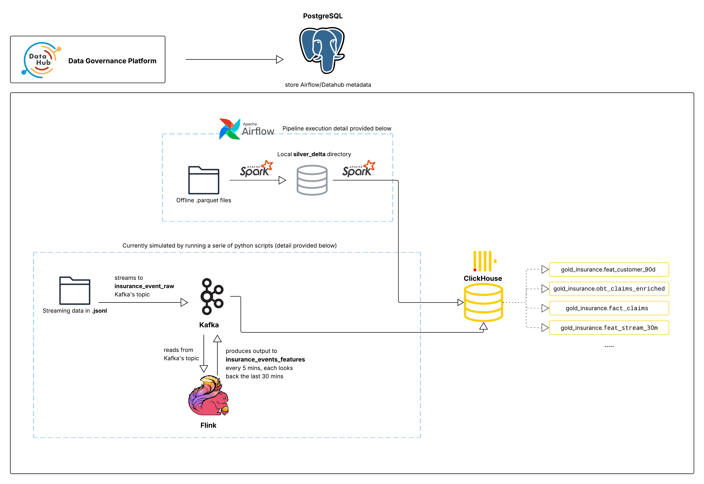
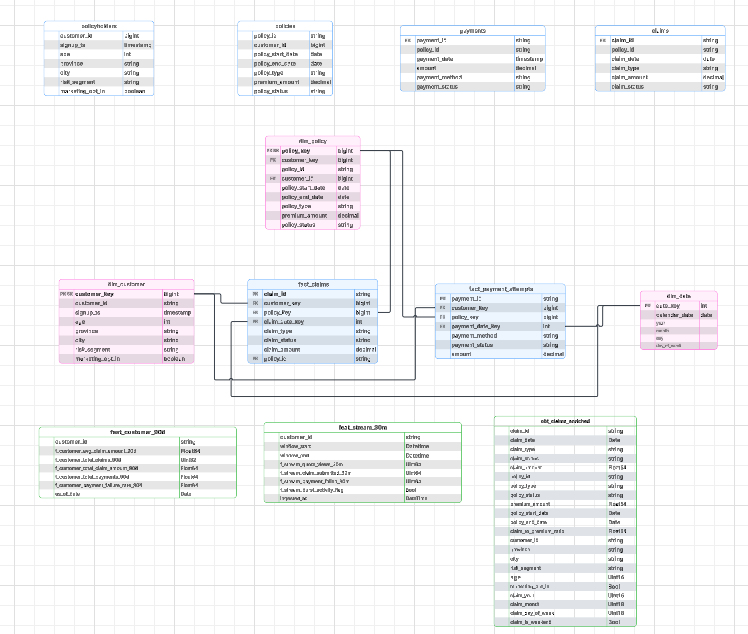
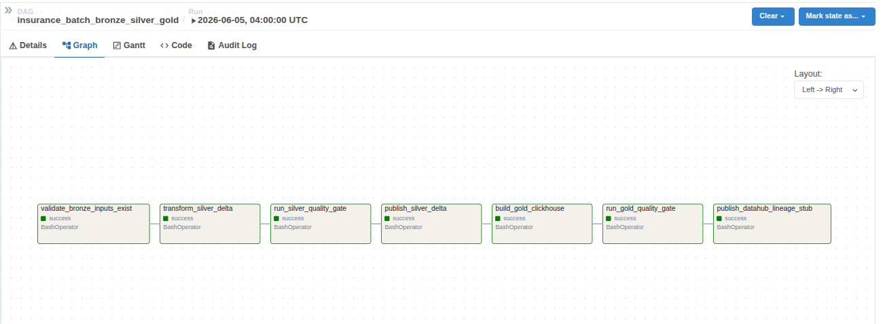
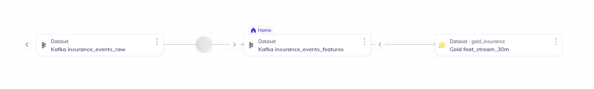
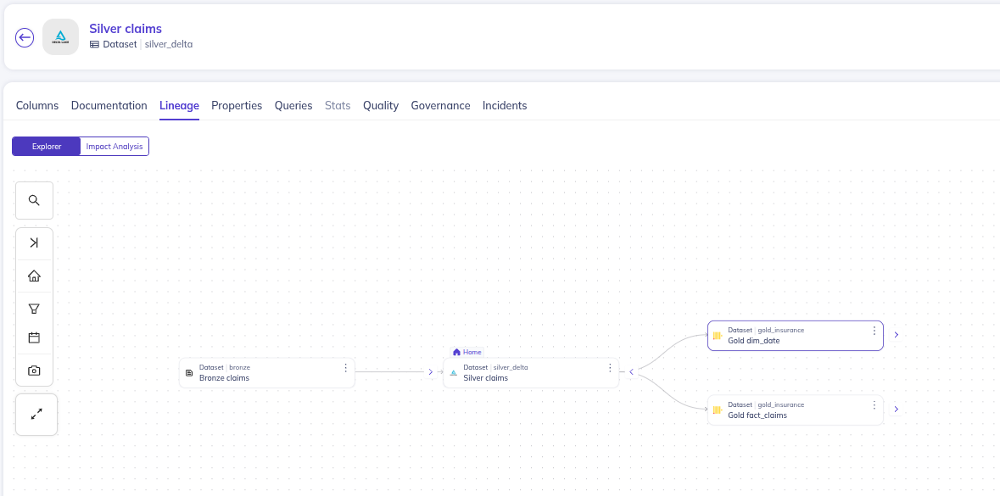

# Insurance Data + AI Engineering Project - Part 1

This imitates a small but production-style insurance data platform. It runs locally with
Docker Compose, but the architecture mirrors a real company: a lakehouse Silver
layer, a SQL Gold warehouse, quality gates, batch + streaming feature pipelines,
orchestration, and governance/lineage.

This document is structured to follow the 02 deliverable coverage: goal setup,
dimension/fact/OBT design, refresh & data quality, feature store, the full data
pipeline plan, and warehouse optimization. It describes **what is actually built
in this repo**, and is explicit about coursework simplifications.

---
## 0. Project architecture

## 1. Goal setup

**Objective.** Build a business-ready Gold zone for insurance analytics, BI, and ML
features, fed by trusted Silver lakehouse tables that are cleaned and quality-gated
from raw source data.

**Modeling approach.** Fact–Dimension (star schema) + One-Big-Table (OBT) +
offline/streaming feature tables.

**Naming conventions.** Gold database `gold_insurance`, with prefixes
`dim_`, `fact_`, `obt_`, `feat_`. Warehouse surrogate keys use the `_key` suffix
(SK); natural identifiers from source are business keys (BK).

**Layers / storage formats.**
- **Bronze** — raw generated source data preserved as-is. Offline tables as
  **Parquet**, streaming events as **JSONL**.
- **Silver** — cleaned, trusted tables as **Delta Lake** (transaction log, schema
  enforcement, time travel, safe overwrite).
- **Gold** — **ClickHouse** (`gold_insurance`), column-oriented OLAP, a better fit
  than PostgreSQL for read-heavy analytical/BI workloads. PostgreSQL is kept only
  for Airflow metadata and the DataHub backend.

**Input data profile.** Synthetic data generated by
`jobs/insurance_data_generator.py` (fixed seed = 42, reproducible):

| Source table | Volume | Key attributes |
|---|---|---|
| policyholders | 10,000 customers | customer_id, signup_ts, province, city, age, risk_segment, marketing_opt_in |
| policies | 15,000 policies | policy_id, customer_id, policy_type, start/end dates, premium_amount, policy_status |
| claims | ~2,700 distinct (incl. ~2% duplicate rows) | claim_id, policy_id, claim_date, claim_type, claim_amount, claim_status |
| payments | 30,000 attempts | payment_id, policy_id, payment_date, amount, payment_method, payment_status |
| streaming events | 35,926 events (1 day) | event_id, event_type, event_timestamp, created_ts, customer_id, policy_id, geo, channel, device |

**Known, intentional data issues (velocity/quality) the pipeline must handle:**
- **Geography skew** — ~70% of customers in Quebec (drives Spark skew-join tuning).
- **Duplicates** — ~2% duplicate claim rows; ~1.5% duplicate streaming event_ids.
- **Schema evolution** — `risk_segment` and `payment_method` are null for records
  before `2025-10-01`. (SCD  )
- **Streaming bursts** — 10× traffic in 08:00–08:20 and 20:00–20:20 windows.
- **Late arrivals** — ~12% of events arrive 5–45 minutes after the event time.

**Assumptions / coursework simplifications (stated up front):**
- The generator is the source system and is run **manually once** before the
  pipeline; it is intentionally **not** part of the DAG.
- Single-node Kafka (KRaft), single Flink TaskManager, `local[*]` Spark.
- Silver/Gold use **full overwrite** rebuilds (idempotent) rather than incremental
  merge/upsert — justified by the small, deterministic dataset (see §7.2).
- Dimensions are **Type-1 (overwrite)**; SCD2 is designed-for but not implemented.

**SLA targets (simulated).** Bronze ≤ 10 min, Silver ≤ 30 min,
Gold fact/OBT ≤ 30 min, `feat_customer_90d` ≤ 60 min, `feat_stream_30m` ≤ 5 min,
availability ≥ 99% of (simulated) scheduled runs/week.

---

## 2. Dimension design



Built by `jobs/gold_clickhouse.py` from trusted Silver Delta tables.

| Dimension | Grain | Keys & columns |
|---|---|---|
| `dim_customer` | one per customer | `customer_key` (SK, `dense_rank`), `customer_id` (BK), signup_ts, age, province, city, risk_segment, marketing_opt_in |
| `dim_policy` | one per policy | `policy_key` (SK), `policy_id` (BK), `customer_key` (FK), policy_type, policy_start_date, policy_end_date, premium_amount, policy_status |
| `dim_date` | one per calendar date | `date_key` (yyyymmdd), calendar_date, year, month, day, day_of_week, is_weekend |

- `dim_date` is built from the union of all business dates (policy start/end, claim
  date, payment date), de-duplicated.
- **SCD strategy:** Type-1 / overwrite. The attributes here (province, risk_segment)
  could change over time; SCD2 (`valid_from_ts`, `valid_to_ts`, `is_current`) is the
  documented upgrade path but is **not implemented** at coursework scale.

---

## 3. Fact design

| Fact | Grain | Keys | Measures |
|---|---|---|---|
| `fact_claims` | one per claim | customer_key, policy_key, claim_date_key (FKs) | claim_amount; degenerate dims claim_type, claim_status |
| `fact_payment_attempts` | one per payment attempt (incl. failures) | customer_key, policy_key, payment_date_key (FKs) | amount; degenerate dims payment_method, payment_status |

**Schema-evolution handling.** Old rows with null `payment_method` are preserved
(`Nullable(String)` in ClickHouse); null `risk_segment` flows through to the customer
dimension as `Nullable(String)`.

**Deduplication.** Silver removes duplicate business keys with a deterministic
window (`row_number()` partitioned by the business key, ordered by event time,
keep newest). Uniqueness is then re-checked in both quality gates (§5).

---

## 4. OBT design

| OBT | Grain | Purpose | Core columns |
|---|---|---|---|
| `obt_claims_enriched` | one per claim (transaction grain) | denormalized table for claim/loss BI & dashboards — no joins needed | claim_id, claim_date, claim_type, claim_status, claim_amount, policy_id, policy_type, policy_status, premium_amount, policy_start/end_date, claim_to_premium_ratio, customer_id, province, city, risk_segment, age, marketing_opt_in, claim_year, claim_month, claim_day_of_week, claim_is_weekend |

Transaction-grain so BI questions (loss by policy_type/geography/time, loss ratio,
claim-status mix) resolve from one wide table. Joins claim → policy → customer →
date; `risk_segment` stays `Nullable` (schema evolution). Partitioned by
`toYYYYMM(claim_date)`, ordered by `(claim_date, policy_type, province, claim_id)`.

---

## 5. Refresh & data quality plan

**Freshness SLAs (simulated).**. Targets are demonstrated through DAG
schedule/retry/timeout configuration rather than measured against a live feed,
because the source is synthetic and the DAG is currently **manual-trigger**.

**Two quality gates (fail-fast).**

1. **Silver gate** — `jobs/silver_quality_checks.py`, runs *after* cleaning and
   *before* Gold. Per table: row count > 0, business key not-null, business key
   unique; plus `claim_amount >= 0` and `payment amount >= 0`. Non-zero exit stops
   the DAG before any Gold table is built.
2. **Gold gate** — `jobs/quality_checks_clickhouse.py`, runs after Gold modeling.
   Checks: dimension/fact business-key uniqueness, fact→dimension FK not-null,
   non-negative measures, and feature range validity
   (`0 <= payment_failure_rate <= 1`). Results are persisted to
   `gold_insurance.quality_check_results` (check_name, status, failure_count,
   checked_at) as durable evidence, not just logs.

Utilizing readable Python/Spark/ClickHouse checks instead of Great
Expectations/Deequ to stay simple and fully runnable in Docker; the gate concept
is identical.

---

## 6. Feature store design

Two feature tables are implemented in `gold_insurance` (a future `feat_customer_unified`
join of the two is documented as next work, not built).

**Offline — `feat_customer_90d`** (`jobs/gold_clickhouse.py`)
- Grain: one per `customer_id` at `as_of_date` (2025-11-01).
- Features: `f_customer_avg_claim_amount_90d`, `f_customer_total_claims_90d`,
  `f_customer_total_claim_amount_90d`, `f_customer_total_payments_90d`,
  `f_customer_payment_failure_rate_90d`.
- **Point-in-time correctness:** only claims/payments in
  `[as_of_date - 90d, as_of_date)` are aggregated — no data later than the
  reference timestamp leaks in.

**Streaming — `feat_stream_30m`** (Flink + `jobs/stream_features_to_clickhouse.py`)
- Grain: one per `customer_id` per sliding window (`window_start`, `window_end`).
- Features: `f_stream_quote_views_30m`, `f_stream_claim_submitted_30m`,
  `f_stream_payment_failed_30m`, `f_stream_burst_activity_flag`.
- 30-minute window, 5-minute slide (HOP), event-time with a 5-minute watermark for
  late events; `window_end` is the point-in-time reference for joins.
- Latest run: **196,485** feature rows across **9,706** customers.

**Dedup policy.** Offline: dedup by business key + event time in Silver. Streaming:
event-time windowing with watermark naturally collapses duplicate event_ids inside
a window.

**Refresh targets.** `feat_customer_90d` ≤ 60 min; `feat_stream_30m` ≤ 5 min
(matches the Flink window slide).

---

## 7. Data pipeline plan & implementation

### 7.1 Batch pipeline (Bronze → Silver → Gold)

Orchestrated by `dags/insurance_batch_pipeline.py`
(DAG `insurance_batch_bronze_silver_gold`):




- **Bronze:** raw source files preserved as Parquet; `validate_bronze_inputs_exist`
  confirms all files exist before processing. (Ingest metadata is added at Silver,
  see below.)
- **Silver (lakehouse, Delta):** type cast/standardize, filter null keys, drop invalid
  (negative) measures, dedup by business key, and add ingest metadata
  (`ingest_ts`, `source_system`, `batch_id`, `ingest_year/month/day`). Written to
  `silver_delta_staging`, validated by the Silver gate, then **published**
  (overwrite) to trusted `silver_delta` partitioned by ingest date.
- **Gold (ClickHouse):** dims, facts, OBT, and `feat_customer_90d`.

### 7.2 Update strategy

- **Bronze:** source files preserved as-is for full reprocessing.
- **Silver:** publish step uses **`overwrite` + `coalesce(1)`** — one clean,
  deduplicated copy per table. This is a deliberate deviation from incremental
  merge: the source is regenerated deterministically, so appending stacked
  identical copies (a real bug we found: 23 appends → ~23× duplicated rows and
  1,400+ tiny files — see §8) and merge buys nothing at this scale.
- **Gold:** each table is `DROP`+`CREATE`+insert (idempotent full refresh).
- **Backfill:** none by default; re-runs are idempotent (overwrite).
- **Late data:** streaming handles lateness via a 5-minute Flink watermark; batch
  re-runs simply reprocess from Bronze.

### 7.3 Streaming pipeline (Kafka → Flink → ClickHouse)



```text
generated JSONL events
  -> jobs/stream_json_to_kafka.py     -> Kafka topic insurance_events_raw
  -> jobs/verify_kafka_topic.py       (gate: topic non-empty)
  -> Flink HOP-window SQL job          (flink/insurance_stream_features.sql,
                                        submitted via flink/run_flink_stream_job.sh)
  -> Kafka topic insurance_events_features
  -> jobs/stream_features_to_clickhouse.py -> gold_insurance.feat_stream_30m
  -> jobs/publish_streaming_lineage.py (DataHub lineage)
```

The vanilla Flink image has no Kafka connector, so
`flink-sql-connector-kafka-3.2.0-1.18.jar` is placed in `flink/` (mounted into the
Flink containers) and attached at submit time. The streaming steps are currently
run via the documented scripts (a DAG/host-script wrapper is optional future work).

### 7.4 Operational controls & monitoring

- **Quality gates per run** — schema/uniqueness/null/referential/measure checks at
  Silver and Gold (§5).
- **Retry/recovery** — DAG `default_args`: 2 retries, 3-minute backoff,
  30-minute task timeout.
- **Run metadata** — `sql/init_postgres.sql` defines
  `pipeline_metadata.pipeline_run_log` (run_id, timings, status, row counts, error
  summary) as the intended run-log target (population is future work).
- **Schedule** — currently `schedule_interval=None` (manual trigger only),
  `catchup=False`. Was `*/30 * * * *` for the SLA simulation.

### 7.5 Lineage tracking (DataHub) — evidence



- **Batch** (`jobs/publish_datahub_lineage.py`): Bronze→Silver→Gold dataset lineage,
  **plus** the Airflow DAG as a `DataFlow` (orchestrator `airflow` → platform
  `urn:li:dataPlatform:airflow`).
- **Streaming** (`jobs/publish_streaming_lineage.py`): JSONL → Kafka raw → **Flink**
  (orchestrator `flink` → platform `urn:li:dataPlatform:flink`) → Kafka features →
  ClickHouse `feat_stream_30m`.
- View in the DataHub UI (`http://localhost:9002`): open a dataset → **Lineage**
  tab, or browse the **Airflow** / **Flink** platforms.

---

## 8. Warehouse optimization

### 8.1 Spark optimizations (applied, with rationale)

Adaptive Query Execution (`adaptive.enabled`); **skew-join** handling
(`adaptive.skewJoin.enabled`) for the intentional Quebec geo-skew; partition
coalescing; `shuffle.partitions=8` for local scale; Kryo serializer; **broadcast
joins** for small dimensions in the Gold job; Delta partitioning in Silver staging
(`policy_type`, `claim_date`, `payment_dt`); `cache()`+`unpersist()` where a frame
is counted then written.

### 8.2 ClickHouse optimizations (applied, with rationale)

- **Storage/layout:** `MergeTree` with a sorting key (`ORDER BY`) per table chosen
  for common filters/joins (e.g. `dim_policy` by `(policy_type, policy_id)`,
  facts by `(date_key, customer_key, policy_key, id)`).
- **Partitioning:** facts `PARTITION BY intDiv(date_key, 100)` to prune by date
  range.
- **Encoding:** `LowCardinality(String)` on categorical columns (province, city,
  policy_type, statuses) to shrink storage and speed grouping.
- Before/after metrics for ClickHouse were not formally captured at this dataset
  size (honest scope note); choices follow ClickHouse OLAP best practice.

---

## 9. Known limitations / future work

- Dimensions are Type-1; **SCD2** not implemented.
- Silver/Gold use full overwrite; **incremental merge/upsert** not implemented.
- `feat_customer_unified` (offline+streaming join) not built.
- `pipeline_run_log` is defined but not yet populated.
- `f_stream_burst_activity_flag` is computed per-customer-per-window
  (`COUNT(*) >= 10`) and never triggers on this data, because bursts are *global*
  traffic spikes spread across ~10k customers — a known feature-definition gap.
- Streaming steps run via scripts; an Airflow/host wrapper is optional next work.

---

## 10. Run locally

```bash
docker compose up -d
# One-time source data (run from a Python env with pandas/numpy/pyarrow):
python jobs/insurance_data_generator.py
```

**Batch:** trigger the DAG `insurance_batch_bronze_silver_gold` from the Airflow UI
(manual trigger).

**Streaming (in order):**
```bash
docker exec insurance_airflow_scheduler python /opt/airflow/jobs/stream_json_to_kafka.py
docker exec insurance_airflow_scheduler python /opt/airflow/jobs/verify_kafka_topic.py
docker exec insurance_flink_jobmanager bash /opt/flink/usrlib/run_flink_stream_job.sh
docker exec insurance_airflow_scheduler python /opt/airflow/jobs/stream_features_to_clickhouse.py
docker exec insurance_airflow_scheduler python /opt/airflow/jobs/publish_streaming_lineage.py
```

**Services / UIs**
- Airflow: `http://localhost:8080` (admin/admin)
- Flink UI: `http://localhost:8081`
- ClickHouse HTTP: `localhost:8123`, database `gold_insurance`
- DataHub: `http://localhost:9002`
- PostgreSQL (Airflow/DataHub metadata only): `localhost:5432`

### Main files
| Path | Purpose |
|---|---|
| `docker-compose.yml` | All local services (Postgres, ClickHouse, Kafka, Flink, Airflow, DataHub). |
| `dags/insurance_batch_pipeline.py` | Batch DAG (manual trigger in Airflow UI). |
| `jobs/insurance_data_generator.py` | Synthetic source data with intentional issues. |
| `jobs/silver_cleaning_delta.py` | Bronze → Silver Delta cleaning. |
| `jobs/silver_quality_checks.py` | Silver quality gate. |
| `jobs/publish_silver_delta.py` | Promote validated staging → trusted Silver (overwrite). |
| `jobs/gold_clickhouse.py` | Silver → Gold dims/facts/OBT/`feat_customer_90d`. |
| `jobs/quality_checks_clickhouse.py` | Gold quality gate → `quality_check_results`. |
| `jobs/stream_json_to_kafka.py` | Replay JSONL → Kafka `insurance_events_raw`. |
| `jobs/verify_kafka_topic.py` | Verify raw topic is non-empty. |
| `flink/insurance_stream_features.sql` | Flink HOP-window streaming features. |
| `flink/run_flink_stream_job.sh` | Submit the Flink SQL job with the Kafka connector. |
| `jobs/stream_features_to_clickhouse.py` | Kafka features topic → `feat_stream_30m`. |
| `jobs/publish_datahub_lineage.py` | Batch + Airflow lineage to DataHub. |
| `jobs/publish_streaming_lineage.py` | Streaming + Flink lineage to DataHub. |
| `sql/init_clickhouse.sql`, `sql/init_postgres.sql` | Service init (Gold DB, run-log table). |
